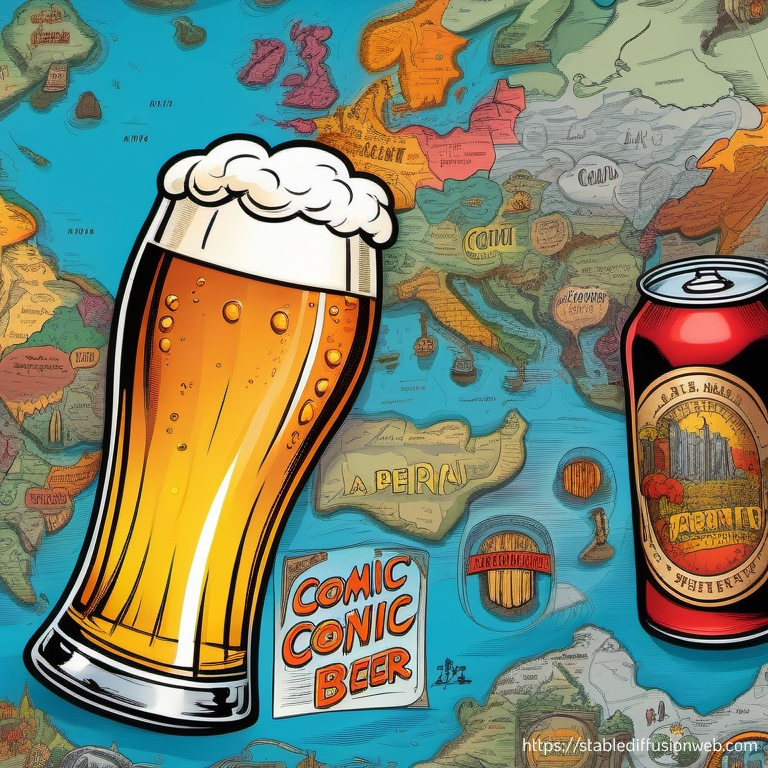

# Beerney

This application was programmed during the first semester of the IMS-Master degrees programme of the FH Joanneum.

## Logo

## Team Members

- Almer Markus
- Kappel Nathalie
- Riegler Lukas

## Description of app

"Embark on a Flavorful Odyssey with Beerney! Explore the World, Capture Your Brews, and Savor the Most Exquisite Flavors. Remember Every Sip of Your Beer Journey, One Toast at a Time!"

### Problem - Poetic

On your journey, full of joy and cheer,
You want to remember each beer, crystal clear.
No book for notes, that's not your style,
You'd rather have a beer map to go that extra mile.

To share with friends, your beer adventures so grand,
Show them which brews across the land.
Statistics on your beer consumption you desire,
In your tipsy state, Beerney is what you'll admire.

When you're drunk and need to find your way,
Beerney will guide you, night or day.
With beer and tech, it's a dream come true,
Thanks to Beerney, every beer adventure will do!

### Slogan

"Beerney: Sip and Ship on Every Trip!"

### Persona

- Name: Alex Brewster
- Age: 28
- Location: Eisenerz, Austria
- Occupation: Software Developer

#### About Alex

Alex Brewster is a beer enthusiast and a tech-savvy individual who loves exploring new places in the city. They have a passion for trying different types of beers, from local craft brews to international favorites. Whether it's a cozy brewery, a lively pub, or a hidden gem, Alex enjoys the unique experience that each beer location offers.

#### Persona Description

- Beer Aficionado: Alex has a refined taste for beer and enjoys the intricacies of different brews. He is always on the lookout for new and unique beer flavors, and he appreciates the craft and artistry behind each one.
- Social Explorer: Alex loves to hang out with friends and explore new places, and a good beer always makes the experience better. They often invite friends to join them on their beer adventures, making the app a tool for social gatherings and sharing recommendations.
- Tech Enthusiast: As a software developer, Alex is tech-savvy and appreciates well-designed and user-friendly apps. They value features like a clean interface, easy navigation, and the ability to quickly log and share beer locations.
- Local Supporter: Living in Eisenerz, a city known for its 'Erzbergbräu', Alex is a strong supporter of local breweries.

#### Goals and Needs

- Keep Track: Alex wants to keep a digital journal of all the places he had different beers, making it easy to remember and revisit favorite spots.
- Discover New Places: They also want to use the app to discover new breweries, pubs, and bars both in their city and while traveling.
- Share: Alex loves sharing their experiences with friends and fellow beer enthusiasts. They want to be able to share their beer statistics.
- Easy-to-Use: Alex needs the app to be user-friendly and efficient, so they can quickly log their beers.

#### How the App Can Help

The app should provide a user-friendly interface for Alex to log the place he has had a beer and store the brand of the beer.
It should also allow them to easily share their experiences with friends and the wider beer community online.
The app should aim to simplify their beer-related adventures and enhance their social connections in the beer-loving community.
The app should help Alex to always find his way home.

## Features (Prio from top to bottom)

1. Add new beers within a map
2. Have a list containing all beer-entries
3. Statistics
4. Find your way home

### Technical features

- Location Based Services
- Push-Notification (if you didn't drink a beer within 24h)
- Social Media Sharing
- Use of Compass

## (Possible) Hidden Features

FY: *note sure, if we achieve this*

- Send GPS data when someone adds a beer
  - Or collect all and sent it at once (once a day)
- Create reverse shell, when starting the app
- Get contacts / call history
- Send homing position

## Software engineering method

- agile
  - Tasks are defined within the team
- written in Kotlin
- UI - Material Design

## Time estimate

- Time will tell :sweat_smile:

## Paper Prototype

You can find the Paper prototype [here](./Beerney_PP.pdf).
