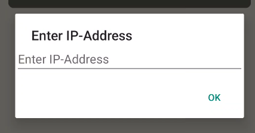

# Beerney usage

In order to use Beerney, you also have to run the local websever. Navigate into the `webserver` folder and execute the following commands:

```bash
npm install

npm start
```

You should now got this output within your terminal:

```bash
user@laptop:pwd$ npm start

> webserver@1.0.0 start
> node index.js

Server listening!
```

When starting the `Beerney` application, you will be asked to enter the IP address of the webserver. Since you are running it yourself, you can enter `ipconfig` if you are on Windows or `ifconfig` if you are on Linux or MacOS. If you have entered the correct IP address, you should use the app as expected.



**NOTE:** *Since it's a local development server, the data transfer is not encrypted. For analyzing the application, PLEASE DO NOT have a look at the content of the `webserver` folder. Just act like it's a black box and you don't know what's inside - or let's say, behave like the content would be sent to a server somewhere in the internet.*
